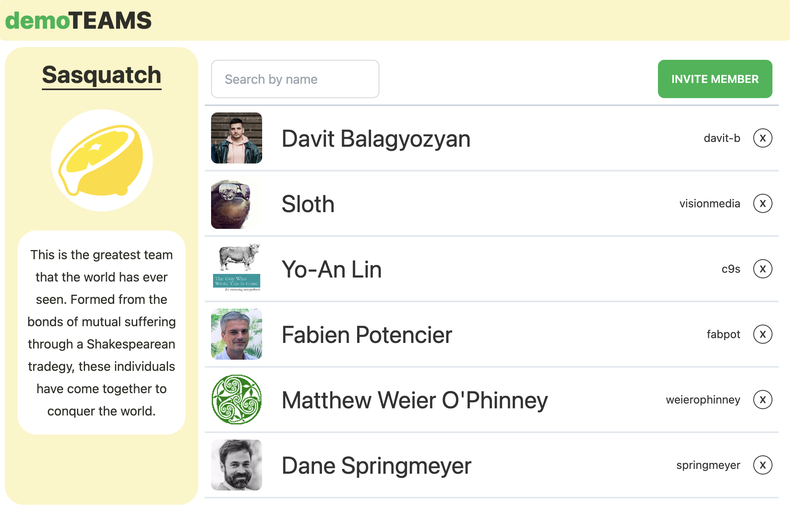
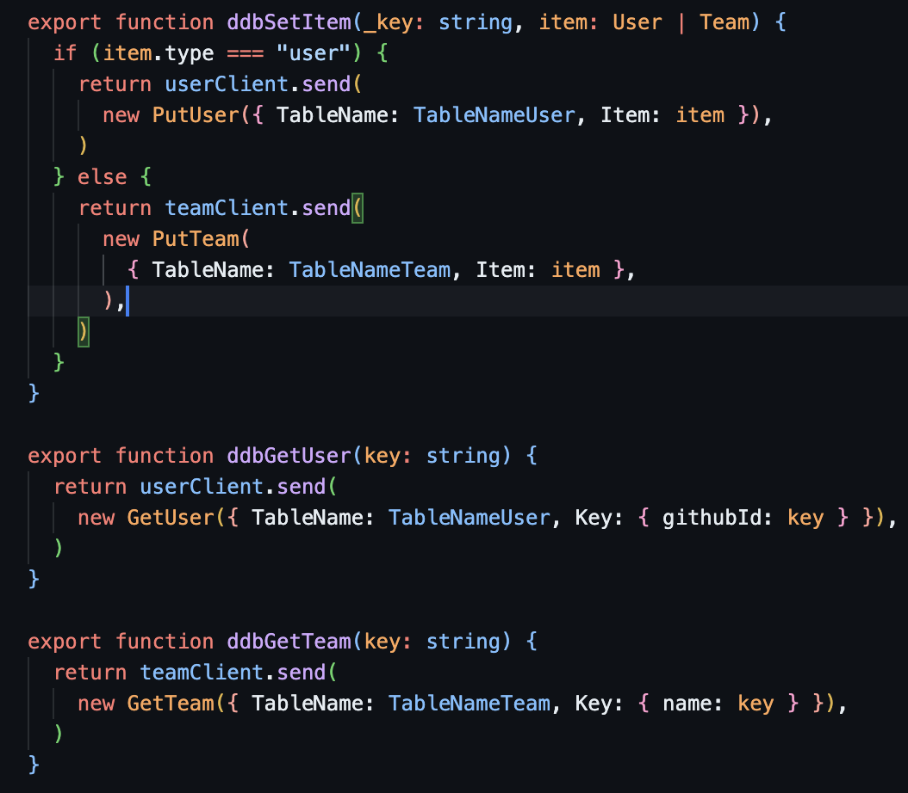

# Deno Fresh + Typesafe DynamoDB + DaisyUI + Tailwind\*

 \* not twind. Using tailwindstandalone-cli to
generate a stylesheet.

---

## Notes

- **Deno Fresh**
- **DynamoDB** For a firestore like EZ-PZ Get(JSON) and Put(JSON) experience.
  (Trust me, look at how easy it )
- **typesafe-dynamo** - for creating a typed client to the dynamoDB table
  - For simplicity sake, the primary keys on the tables are set to User: `name`
    and Team: `githubId`. You can change however you like.
- **tailwindcli** - for generating a `/static/tailwind.css` file to deploy
  - Twind is removed from this package. This is because twind doesn't work with
    DaisyUI's plugins. Twind has it's own plugins and is not compatible with the
    tailwind ecosystem.
- **DaisyUI** and **Tailwind Typography** plugins - these are used with
  tailwind.

<details>
  <summary>ABOUT DYNAMODB</summary>

#### ...It's easy at pie.

DynamoDB sucks in a lot of regards. But with typescript and lil' magic, you can
make it as easy a Firestore! Here's the flow

1. Define your typescript types for you data model
2. Copy and plug those types into `utility.ddb-client.ts`
   1. Note what your Primary key is for the items. It can be `id` or for the
      (like me) use the `githubId`.
3. Call Get and Put. (You can implement Update... thou it's trickier)

That's it! Look how easy it is. 

Your typescript types define the model, and there is no need to define a Dynamo
schema or anything. It kinda just works. Takes ~10 min to set up.

</details>

---

#### Requirements

- A Github API Key (optional: you will get throttled)
- AWS Access and Secret Key
- 2x AWS DynamoDB tables created with names defined in `_utility/ddb-client.ts`
  - A table TableNameTeam = `construct_team_table` and primary key of
    `TeamTablePK = "name"`
  - A table TableNameUser = `construct_user_table` and primary key of
    UserTablePK = `githubId`

#### One-time operations!

1. Download the TailwindCLI into this directory by running
   `download-tailwind-macos.sh`
2. Run `npm install` to install the dev-time dependencies daisyui and typography
   modules
3. Create a `.env` file and fill in

```bash
# .env
export gh_token=BLAHBLAHBLAH
export AWS_ACCESS_KEY_ID="BLAHBLAHBLAH"
export AWS_SECRET_ACCESS_KEY="BLAHBLAHBLAH"
```

afterwards...

#### Usage

1. Run `deno task start`.

   This will generate the `/static/tailwind.css` file on the fly which is a
   conglomerate stylesheet of tailwind + daisyui + typography. You can view the
   use of `/static/tailwind.css` in the `/routes/_app.tsx` where it is included
   in the head. That's it for development.

### Deployment

1. Push to a github repo.
2. Connect it to Deno Deploy, and it should deploy.

## FAQ

#### How to change the favicon?

1. Place a new favicon icon (.ico, .png, .whatever) into `/static/`
2. Go to `/routes/_app.tsx` and update the
   `<link rel="icon" type="image/png" href="../icons8-motherboard-32.png"></link>`

#### How do I update the dynamo configurations?

1. Go to `/_utility/ddb-client.ts`
2. Update the following (you can change region, tablenames, and even the primary
   keys on the table.)

```ts
export const Region = "us-east-1"
export const TableNameTeam = "construct_team_table"
export const TableNameUser = "construct_user_table"
const TeamTablePK = "name"
const UserTablePK = "githubId"
```
